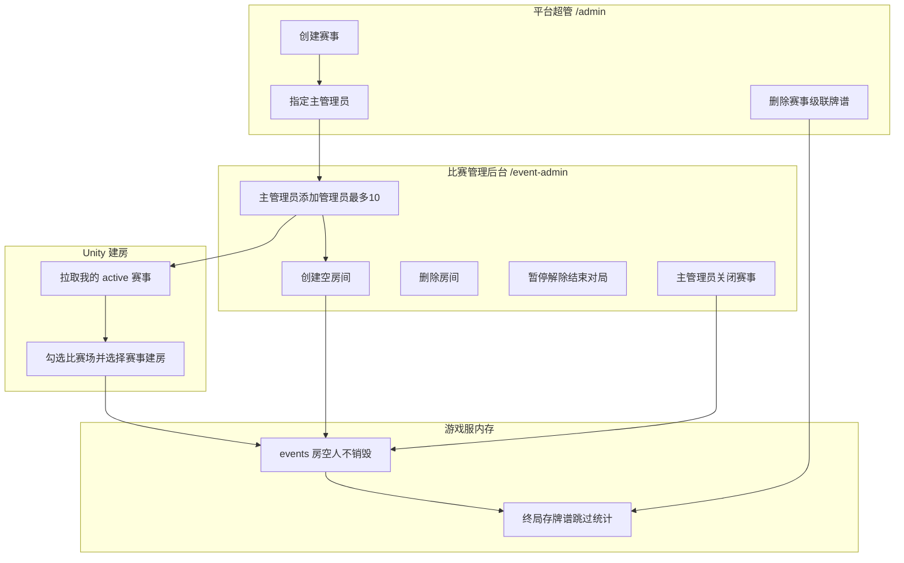

# 比赛场（Events）功能设计

> 状态：设计稿（待实现）  
> 依据：用户确认 2026-07-10

## 1. 目标与边界

### 要做

- 平台超管（`ADMIN_USER_IDS`，如 `10000001`）在 **管理后台** 创建 / 关闭 / 删除赛事，并指定赛事主管理员 / 赛事子管理员。
- **玩家可在网站登录后申请办赛**；超管审批通过后自动创建赛事（状态 `registered`），并将申请人设为赛事主管理员。
- 独立 **比赛管理后台**（`/event-admin`）及账户页内嵌管理面板，供赛事主管理员与赛事子管理员使用。
- 赛事主管理员可为**本赛事**添加最多 10 名赛事子管理员。
- 仅 `active`（已开启）赛事允许主/子管理员在 Unity 或 Web 创建比赛房间。
- 比赛场房间：人走不销毁；可创建 / 删除房间；对局暂停 / 解除 / 结束复用现有对局管理能力（按赛事过滤）。
- 牌谱保存，`room_type='events'` + `event_id`；**不计入**段位 / 排行榜 / 胜率等统计。
- 数据查询站可按「比赛场」及具体赛事（含历史）筛选牌谱。
- 首页展示近期比赛；公开赛事列表 / 详情页。

### 不做（本期）

- 赛事积分榜、赛程编排、**参赛报名系统**。
- 玩家无需审批直接自建比赛场。
- 全局「所有赛事总管」角色（主管理员只绑定单个赛事）。
- Web 端注册 / 改用户名（登录复用游戏已注册账号）。

---

## 2. 角色与权限矩阵

| 能力 | 平台超管 | 赛事主管理员 | 赛事子管理员 | 普通玩家 |
|------|----------|--------------|--------------|----------|
| 创建 / 删除赛事 | ✅ | ❌ | ❌ | ❌ |
| 首次开启本赛事（registered→active） | ✅ | ✅ | ❌ | ❌ |
| 关闭本赛事（active→closed） | ✅ | ✅ | ❌ | ❌ |
| 申请重新开启 / 审核再开 | 审核 ✅ | 申请 ✅ | ❌ | ❌ |
| 指定主管理员 / 子管理员 | ✅ | 仅本赛事子管理员（≤10） | ❌ | ❌ |
| 创建空房间（Web，仅 active） | ✅（任意赛事） | ✅（本赛事） | ✅（本赛事） | ❌ |
| Unity 建房见比赛场选项（仅 active） | ❌（走 Web 超管）* | ✅（本赛事） | ✅（本赛事） | ❌ |
| 删除本赛事房间 | ✅ | ✅ | ✅ | ❌ |
| 暂停 / 解除 / 结束本赛事对局 | ✅ | ✅ | ✅ | ❌ |
| 查看本赛事房间与牌谱数据 | ✅ | ✅ | ✅ | 公开查询站可筛历史牌谱 |

\* 平台超管若同时被设为某赛事主/子管理员，则 Unity 也可建该赛事房；否则超管用管理后台建空房即可。

### 赛事状态

| 状态 | 含义 | 可新建房间 | 数据查询可见 |
|------|------|------------|--------------|
| `registered` | 已注册（审批通过/超管创建后，尚未开启） | ❌ | ✅ |
| `active` | 已开启 | ✅ | ✅ |
| `closed` | 已关闭；再开需主管理员申请 + 平台超管审核 | ❌ | ✅（历史） |
| 删除 | 物理删除赛事行 + 级联删该 `event_id` 下全部牌谱 | — | — |

- **首次开启**：赛事主管理员可从 `registered` 直接开启为 `active`。
- **关闭**：平台超管或该赛事主管理员；关闭后 `reopen_requested=false`。
- **重新开启**：主管理员提交申请（`reopen_requested=true`）→ 平台超管 `activate` 批准或 `reject-reopen` 拒绝。
- **删除**：仅平台超管；需二次确认；级联删除 `game_records`（经 `game_player_records.event_id` 定位）。

---

## 3. 数据模型（PostgreSQL）

### 3.1 `events`

```sql
CREATE TABLE events (
  event_id          VARCHAR(32) PRIMARY KEY,  -- 唯一 ID，如 evt_ + base62
  name              VARCHAR(128) NOT NULL,
  description       TEXT NOT NULL DEFAULT '',  -- 办赛申请时的赛事介绍（公开）
  status            VARCHAR(16) NOT NULL DEFAULT 'registered',  -- registered | active | closed
  reopen_requested  BOOLEAN NOT NULL DEFAULT FALSE,
  created_by        BIGINT NOT NULL,
  closed_at         TIMESTAMPTZ NULL,
  created_at        TIMESTAMPTZ NOT NULL DEFAULT NOW(),
  updated_at        TIMESTAMPTZ NOT NULL DEFAULT NOW()
);
CREATE INDEX idx_events_status ON events(status);
```

### 3.2 `event_admins`

```sql
CREATE TABLE event_admins (
  event_id   VARCHAR(32) NOT NULL REFERENCES events(event_id) ON DELETE CASCADE,
  user_id    BIGINT NOT NULL,
  role       VARCHAR(16) NOT NULL,  -- owner=赛事主管理员 | admin=赛事子管理员
  added_by   BIGINT NOT NULL,
  created_at TIMESTAMPTZ NOT NULL DEFAULT NOW(),
  PRIMARY KEY (event_id, user_id),
  CONSTRAINT event_admins_role_chk CHECK (role IN ('owner', 'admin'))
);
CREATE INDEX idx_event_admins_user ON event_admins(user_id);
```

约束（应用层）：

- 每个赛事恰好 1 名 `owner`（创建时指定或稍后指定；可更换）。
- `admin` 人数 ≤ 10（不含 owner）。
- 同一用户可担任多个赛事的管理员（不同 `event_id`）。

### 3.3 `event_applications`（玩家办赛申请）

```sql
CREATE TABLE event_applications (
  application_id     BIGSERIAL PRIMARY KEY,
  applicant_user_id  BIGINT NOT NULL,
  name               VARCHAR(128) NOT NULL,
  description        TEXT NOT NULL DEFAULT '',
  remark             TEXT NOT NULL DEFAULT '',
  status             VARCHAR(16) NOT NULL DEFAULT 'pending',  -- pending|approved|rejected|cancelled
  reviewer_user_id   BIGINT NULL,
  review_note        TEXT NULL,
  event_id           VARCHAR(32) NULL REFERENCES events(event_id) ON DELETE SET NULL,
  created_at         TIMESTAMP DEFAULT CURRENT_TIMESTAMP,
  updated_at         TIMESTAMP DEFAULT CURRENT_TIMESTAMP,
  reviewed_at        TIMESTAMP NULL
);
-- 同一用户最多一条 pending（部分唯一索引）
```

超管审批通过：创建 `events` + `event_admins(owner=申请人)`，并回填 `event_id`。

### 3.4 复用已有字段

- `game_player_records.room_type = 'events'`
- `game_player_records.event_id`（已有 VARCHAR(64)）
- 牌谱 JSON `game_title.event_id`
- 房间内存字段：`room_type`、`event_id`、`persist_empty=true`（比赛房固定）

删除赛事时：

```sql
-- 1) 找出该赛事全部 game_id
SELECT DISTINCT game_id FROM game_player_records WHERE event_id = $1;
-- 2) DELETE FROM game_records WHERE game_id = ANY(...)
--    → ON DELETE CASCADE 清理 game_player_records
-- 3) 可选：清理 game_player_metrics 中同 event_id 行
-- 4) DELETE FROM events WHERE event_id = $1  → CASCADE event_admins
```

统计表：写入时跳过 `room_type='events'`，删除赛事一般无需回滚段位（本来就没写）。

---

## 4. 房间与对局行为

### 4.1 创建

**Unity（有权限用户）**

- `CreatePanel`：仅当服务端返回「可管理的 active 赛事列表」非空时，显示：
  - 勾选「比赛场」
  - 下拉选择赛事（仅自己有权限且 `status=active` 的赛事）
- 勾选后建房请求带 `room_type: "events"` + `event_id`。
- 无权限用户完全看不到这两项。

**Web 管理后台 / 比赛管理后台**

- 可创建**空房间**（`player_list=[]`，无房主）。
- 调用游戏服 HTTP：`POST /admin/event/rooms/create`（Node 代理）。
- 空房进入大厅房间列表，玩家可加入。
- **房主规则（已确认 B）**：空房无房主；**第一个加入的真人**成为房主（与现有 `host = player_list[0]` 一致）。

### 4.2 不因空房销毁

现有逻辑（`room_manager.leave_room`）：`player_list` 空或仅剩机器人 → `destroy_room`。

比赛房改为：

```python
if room_data.get("room_type") == "events" or room_data.get("persist_empty"):
    # 允许空房间；仅剩机器人时清机器人但保留房间
    ...
else:
    # 现有销毁逻辑
```

删除房间：仅赛事管理员 / 超管显式调用 `destroy_room`（Web 或后续扩展 WS）。

### 4.3 对局控制

复用现有：

- `POST /api/admin/game-control/pause|resume|end`
- 游戏服 `/admin/game/pause|resume|end`

赛事后台：列表按 `event_id` 过滤，仅展示本赛事进行中对局；操作前校验调用者对该 `event_id` 有权限。

### 4.4 牌谱与统计

- 终局写入：`room_type='events'`，`event_id=...`，保存 `game_records`。
- **跳过**：`*_history_stats`、`*_fan_stats`、`rank_data` 更新。
- `game_player_metrics` / `scene_daily_stats`：可不写，或写入但平台公开统计 API 排除 `events`（推荐：写入 metrics 供赛事后台汇总，公开平台统计排除）。

---

## 5. API 设计

### 5.1 平台管理后台（`requireAdmin` + `ADMIN_USER_IDS`）

| 方法 | 路径 | 说明 |
|------|------|------|
| GET | `/api/admin/events` | 列表（含 closed） |
| POST | `/api/admin/events` | 创建 `{ name, owner_user_id? }` |
| POST | `/api/admin/events/:id/close` | 关闭 |
| DELETE | `/api/admin/events/:id` | 删除 + 级联牌谱（body: reason） |
| GET | `/api/admin/events/:id/admins` | 管理员列表 |
| PUT | `/api/admin/events/:id/owner` | 设置/更换主管理员 |
| POST | `/api/admin/events/:id/admins` | 添加普通管理员 |
| DELETE | `/api/admin/events/:id/admins/:userId` | 移除管理员 |
| POST | `/api/admin/events/:id/rooms` | 创建空房间（代理游戏服） |
| GET | `/api/admin/events/:id/rooms` | 本赛事房间列表 |
| DELETE | `/api/admin/events/:id/rooms/:roomId` | 删除房间 |
| GET | `/api/admin/events/:id/games` | 进行中对局（过滤） |
| POST | `/api/admin/events/:id/games/:gid/pause\|resume\|end` | 对局控制 |

### 5.2 比赛管理后台（新鉴权）

登录：复用用户账号密码，签发 **Event JWT**（`aud=event-admin`），payload 含 `user_id`；每次请求查 `event_admins` 得可管理赛事。

| 方法 | 路径 | 说明 |
|------|------|------|
| POST | `/api/event-admin/login` | 登录（非游客；须至少有一条 event_admins） |
| GET | `/api/event-admin/me` | 我的赛事与角色 |
| GET | `/api/event-admin/events` | 我管理的赛事 |
| POST | `/api/event-admin/events/:id/close` | 仅 owner |
| GET/POST/DELETE | `/api/event-admin/events/:id/admins` | 仅 owner；admin≤10 |
| POST/GET/DELETE | `.../rooms` | 房间 CRUD（本赛事） |
| GET + pause/resume/end | `.../games` | 本赛事对局 |
| GET | `/api/event-admin/events/:id/records` | 本赛事牌谱列表（可空房无关） |

中间件 `requireEventAdmin`：JWT 有效 + 对 `:id` 有 `owner|admin`。

### 5.3 游戏服（FastAPI，仅 Node 代理）

| 方法 | 路径 | 说明 |
|------|------|------|
| POST | `/admin/event/rooms/create` | 空房 / 代建，校验 event active |
| GET | `/admin/event/rooms` | `?event_id=` |
| DELETE | `/admin/event/rooms/{room_id}` | 销毁房间（进行中对局则拒绝或先 end） |
| GET | `/admin/game/list` | 扩展返回 `event_id`，供过滤 |

### 5.4 Unity WebSocket

| 消息 | 说明 |
|------|------|
| `event/list_my_active` | 返回当前用户可建房的 active 赛事 |
| `room/create_*_room` | 增加可选 `event_id`；有则 `room_type=events` 并校验权限与 active |

---

## 6. 前端页面

### 6.1 平台管理后台 `/admin`

新菜单「赛事」：

- 赛事列表：创建、关闭、删除、状态、主管理员。
- 详情：管理员增删、创建空房间、房间列表删除、跳转对局控制（过滤）。

### 6.2 比赛管理后台 `/event-admin`（独立布局）

- 登录页（与 `/admin/login` 分离）。
- 我的赛事列表。
- 赛事详情：房间（创建空房 / 删除）、进行中对局（暂停/解除/结束）、牌谱列表。
- 主管理员：管理员管理（最多 10 名）、关闭赛事。

### 6.3 Unity `CreatePanel`

- 登录后拉取 `event/list_my_active`。
- 有数据才显示「比赛场」勾选 + 赛事下拉。
- 勾选后建房带 `event_id`。

### 6.4 数据查询站 `PlayerData.vue`

- 场次选「比赛场」时，二级下拉：`GET /api/player/events`（全部历史赛事 id+name+status）。
- 筛选：`tier=events` + 可选 `event_id`。
- 列表展示赛事名（由 event_id 映射）。

---

## 7. 关键流



---

## 8. 实现分期

### Phase 1 — 数据与平台超管（已完成）

1. 建表 `events` / `event_admins`（Python `db_manager` 迁移 + Node `ensureEventsTables`）。
2. `/api/admin/events*` CRUD、管理员指定、关闭、删除级联牌谱。
3. Admin UI「赛事」列表 / 详情页。

### Phase 2 — 房间与牌谱链路（已完成）

1. 游戏服：建房带 `event_id`、`persist_empty`、leave/kick 空房不销毁；join 同步房主。
2. 空房创建 / 列表 / 删除 HTTP API；Node 超管代理；赛事详情「空房间」卡片。
3. 国标/青雀/古典/立直终局：`events` 跳过 history/fan stats（仍存牌谱）。
4. Unity：`event/list_my_active` + CreatePanel「比赛场」勾选/赛事下拉 + 建房 `event_id`。

### Phase 3 — 比赛管理后台（已完成）

1. Event JWT（`aud=event-admin`）+ `/api/event-admin/*`。
2. `/event-admin` 布局与页面（房间 / 对局 / 管理员 / 关闭 / 牌谱）。
3. 对局控制按 `event_id` 鉴权包装。

### Phase 4 — 数据查询站（已完成）

1. `GET /api/player/events` 历史赛事列表（含已关闭）。
2. `PlayerData` 选「比赛场」后二级下拉筛选具体赛事；对局列表展示赛事名。
3. `tier=events` + 可选 `event_id` 过滤牌谱 / 顺位统计。

---

## 9. 审计与安全

- 平台侧写操作继续 `admin_audit_log`（`event.create/close/delete`、`event.admin.*`、`event.room.*`）。
- 赛事后台可写 `event_admin_audit_log` 或复用同表加 `actor_type=event_admin`。
- 删除赛事强制 `reason` + 确认赛事名。
- 游戏服 event 管理接口仅 localhost / Node 代理，不公网直连。
- 关闭后拒绝一切新建房间（Unity + Web）。

---

## 10. 已确认需求摘要

1. Web 可建空房；Unity 有权限可建；退出不销毁。
2. 勾选 + 下拉选已有赛事。
3. `/admin` 与 `/event-admin` 两套独立界面。
4. 不计入平台统计；牌谱可查；查询站可筛具体赛事。
5. 管理员只管所属赛事房间（创建/删除）；对局控制复用暂停/解除/结束。
6. 超管创建赛事并指定主管理员后交由主管理员运营。
7. 关闭保留牌谱；删除级联牌谱；仅超管可删；主管理员可关；普通管理员不可关/删赛事。
